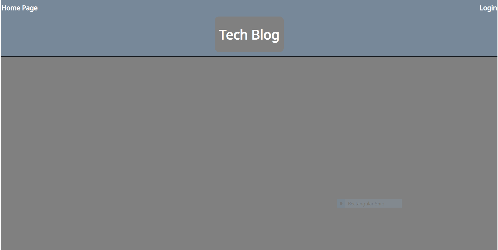
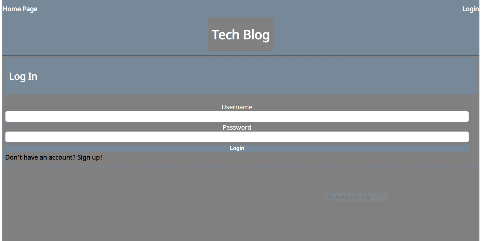
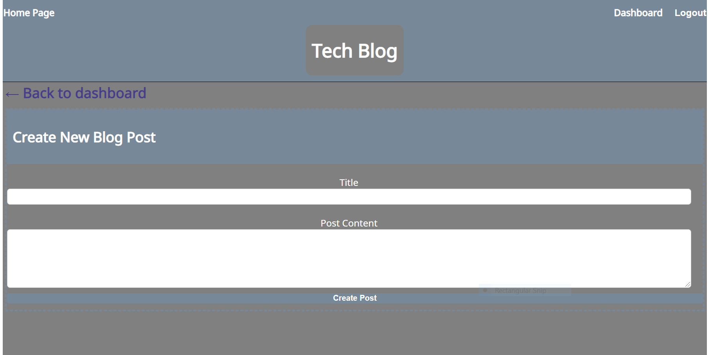

# Tech Blog
## Description

The goal of this project was to build a CMS-style blog site similar where developers can publish their blog posts and comment on other developer's posts.

- When the user visits the site for the first time, they are taken to the homepage of the tech-blog which displays existing blog posts that include the post title, date, and the user and time it was posted. The user is also presented with an option to login

- When the user clicks the login button, they are taken to the page to enter their username and password. There is also an option to signup instead

- If the user chooses to sign up, they are prompted to create a username and password

- When the user signs up, their username and password are saved and they are logged into the site until they logout

- When the user is signed in, they can see navigation links for the homepage, the dashboard an option to log out, as well as an option to creat a new post

- When the user clicks on "create new post" they are able to write a title and description of the post content

- Once the user writes their title and comment they are able to click the create post button to post it

- When the user submits their post and they click the button to go back to the dashboard where they can see the post they just created. 

- On the dashboard the user is presented the option to edit their post

- If the user edits their post they can either edit the title or comment and click "update" or the user can click "delete" to delete their post

- When the user clicks on an existing blog post, then they are presented with a post title, contents, post creator's username, and date created for that post as well as the option to leave a comment on the post

- When the user enters a comment and submits, then the comment is saved and the post is updated to display the comment, the comment creator's username and the date created

- When the user clicks the log out button, then they are signed out of the site

 

## Table of Contents

- [Installation](#installation)
- [Screenshot](#screenshot)
- [GitHub](#Github)
- [Credits](#credits)
- [License](#license)

 

## Installation
- Clone the respositry from Github to your local machine 
- Open up your preferred terminal and navigate to the directory where you cloned the github repository
- Run in the terminal:
- npm install
- then --> Open MYSQL workbench and exeute the schema
- Run node server.js on the root
- Open localhost 3001 
- Navigate to Heroku to see it live there

 

## Dependancies to Install
- bcrypt
- connect-session-sequelize
- dotenv
- express
- express-handlebars
- express-session
- handlebars
- mysql2
- sequelize

 

## Usage

Open a browser and search for localhost:3001
Open with Heroku link below and view the deployed application

 

## Screenshot
 
 
 
 
 
 

## Github Repository
[Github](https://github.com/efagioli01/Tech-Blog)

 

## Credits

Collaborators - Patrick Sullivan [Github](https://github.com/shabobble) Alan Balcom [Github](https://github.com/abalcs) Swetha Redivari [Github](https://github.com/swethareddyl)

UNH Full Stack Coding Book Camp partnered with Trilogy Education Services

Course Instructor - Benjamin Hutchins

Course TA - Andrew Hatfield

Tutor - Morgan Splawn

 

## MIT License

Copyright (c) [2021] [Erica Fagioli] 

Permission is hereby granted, free of charge, to any person obtaining a copy
of this software and associated documentation files (the "Software"), to deal
in the Software without restriction, including without limitation the rights
to use, copy, modify, merge, publish, distribute, sublicense, and/or sell
copies of the Software, and to permit persons to whom the Software is
furnished to do so, subject to the following conditions:

The above copyright notice and this permission notice shall be included in all
copies or substantial portions of the Software.

THE SOFTWARE IS PROVIDED "AS IS", WITHOUT WARRANTY OF ANY KIND, EXPRESS OR
IMPLIED, INCLUDING BUT NOT LIMITED TO THE WARRANTIES OF MERCHANTABILITY,
FITNESS FOR A PARTICULAR PURPOSE AND NONINFRINGEMENT. IN NO EVENT SHALL THE
AUTHORS OR COPYRIGHT HOLDERS BE LIABLE FOR ANY CLAIM, DAMAGES OR OTHER
LIABILITY, WHETHER IN AN ACTION OF CONTRACT, TORT OR OTHERWISE, ARISING FROM,
OUT OF OR IN CONNECTION WITH THE SOFTWARE OR THE USE OR OTHER DEALINGS IN THE
SOFTWARE.